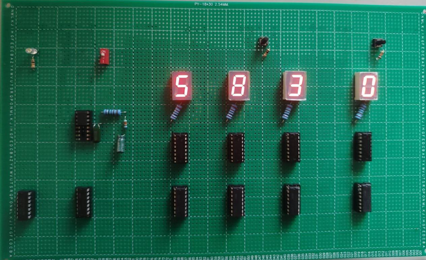
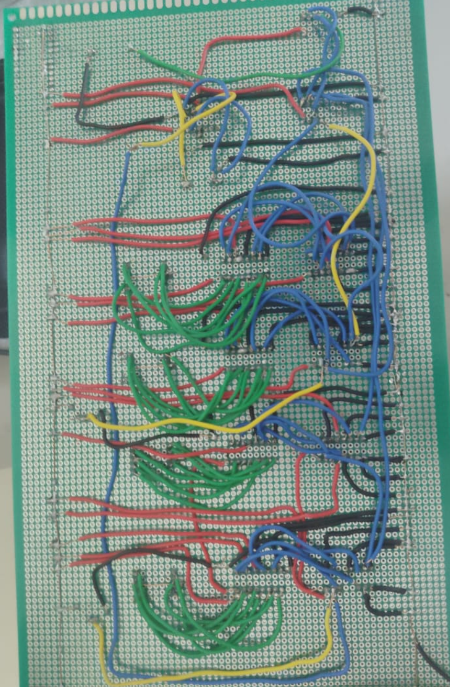
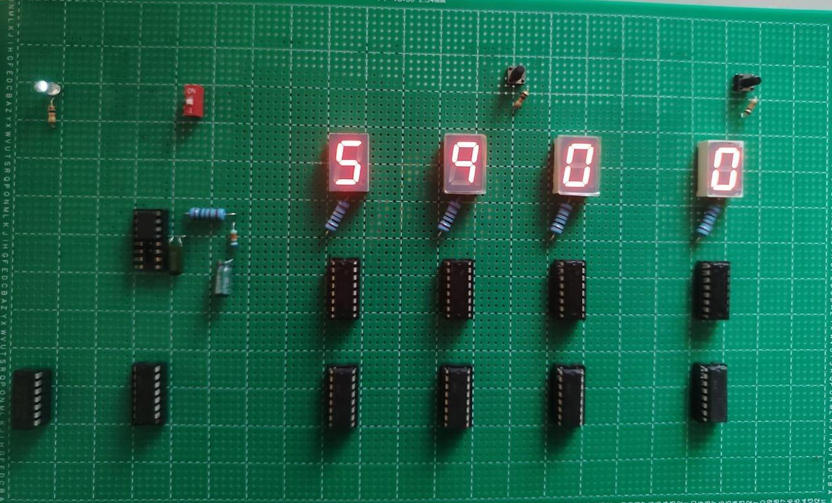

# Discrete Logic NE555–BCD Countdown Timer

A digital countdown timer designed using NE555 timer circuitry, BCD counting logic, and digital display circuitry. The project was simulated in Proteus and physically implemented and tested on hardware.

## Overview

The system generates clock pulses using an NE555 timer, which drive the BCD counting stages to perform the countdown. The countdown value is displayed digitally, and an alert/output condition is generated when the count reaches `00`.

## Key Features

- NE555-based clock generation
- BCD-based countdown logic
- Digital countdown display
- Zero-count detection and alert output
- Proteus circuit simulation
- Physical hardware implementation
- Hardware testing and working demonstration

## Working Principle

```text
NE555 Timer
     ↓
Clock Pulses
     ↓
BCD Counting Logic
     ↓
Countdown Display
     ↓
Zero Detection
     ↓
Alert / Output
```
## Hardware Implementation

### PCB Component Side



### PCB Solder Side



### Countdown Output at 00




## Simulation

The circuit was designed and verified using Proteus.


## Working Demonstration

[Countdown Timer Working Demo](hardware/Countdown_Timer_Working_Demo.mp4)

## Project Structure

```text
docs/
└── Digital Countdown Timer Report.pdf

hardware/
├── Countdown_Timer_Working_Demo.mp4
├── PCB_Component_Side.png
├── PCB_Implementation_Output_alert_at_00.png
└── PCB_Solder_Side.png

simulation/
├── Countdown_Timer_Schematic_Proteus.pdsprj
└── Proteus_Circuit_Diagram_Countdown_Timer.png
```
README.md
